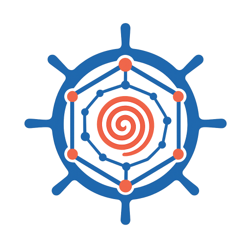

[](./LICENSE)
[](https://www.python.org/)
[](https://poiesis.vercel.app)

# poiesis

<div align="center">
  
  <br>
  <em>TES (Task Execution Service) on kubernetes</em>
</div>

A [GA4GH TES][tes] task execution service for Kubernetes.

## Development

```sh
mise install        # tools + venv
lefthook install    # git hooks
mise run dev        # start the API
mise run checks     # run all checks with auto-fix
```

Other tasks: `mise tasks`.

## License

[Apache License 2.0](./LICENSE).

[tes]: https://github.com/ga4gh/task-execution-schemas
